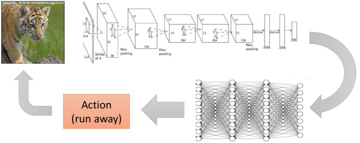
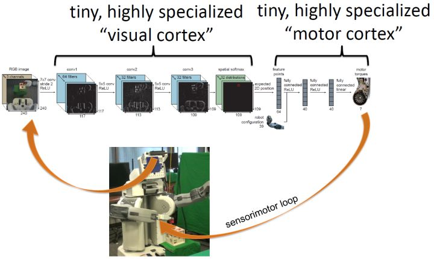

# (1) 简介

> 作者：[谢天](https://www.zhihu.com/people/xie-tian-55-77)
> 
> 来源：[POST 馆](https://zhuanlan.zhihu.com/c_150977189)

## 什么是增强学习？

首先我们不要去想很酷炫的人工智能，而从我们会如何训练一只狗谈起：你很可能会想训练狗去做一些事情，比如让狗坐下。一种可行的办法是，如果狗做出了你喜欢的行为，那么你将对狗进行奖励；而如果狗做出了你不喜欢的行为，则对狗进行惩罚（或者不给予奖励）。具体来说，每次你一叫狗坐下狗就坐下，你就给他点儿好吃的；而如果它没有坐下，那么就不给吃的。通过类似这样的效应，狗就能通过这种获得奖励的机制来逐渐学习到你想让它干什么。

**增强学习** (Reinforcement Learning) 本身则基本是对这一个原则的数学化描述。增强学习有一个学习者，经常称为**智能体** (agent)。智能体需要和周围的环境和整个世界打交道，智能体所做的事情是做出**决策** (decision)，来执行什么**行动** (action)，在一些时候也成为**控制** (control)；而世界环境则接受智能体所做出的决策，并给出相应的后果。我们主要关注的是两种后果：第一种是智能体所能看到或者感知到的它的行动所产生的结果，称为**观测** (observation)：譬如一个机器人想要到某个地方去，它能“看”到它经过一整个过程的周围景观；另一种是智能体能直接通过做出某项行动所受到的**奖励** (reward)，譬如狗能够得到食物来让它的胃得到满足。

用几个简单的例子来说明这一问题。

1.  第一个是狗，作为一个动物，它能影响世界的方式主要是通过肌肉活动，来发出声音或者移动四肢之类的作为行动。它的观测来自于它的感知器官，如视觉和嗅觉。它的奖励譬如给予的食物。狗通过这些东西来认知到它是不是在做一件正确的事情。
2.  第二个是 Baymax 大白，它能影响世界的方式主要通过它的电动机，因此行动主要由控制电动机的电流、扭矩等的致动器来做出。它的观测主要来源于它的传感器、摄像头等，而它的奖励是由一些代码决定的，如任务执行成功度的评分：如果 Baymax 要学习如何跑得快，那么奖励就是它的跑步速度。
3.  第三个是运筹学中的库存管理问题，这一问题中的行动如系统在什么时候买什么东西，观测为商品的库存水平，奖励是系统运行的利润：我们一般知道如果商品库存过多则需要很多的库存费用，而库存过少则不能满足销售需求而使整体利润降低。
4.  此外，也可以运用到机器翻译中。如行动是法语句子，观测为英语句子，奖励是诸如 BLEU 评分 (Papineni et al., 2002)。

事实上，世界中有很多各种各样的问题可以被描述为增强学习问题。增强学习问题也是最广义的机器学习问题之一。值得一提的是，所有监督学习问题都可以被重新表述成一个增强学习问题，即便这不见得是一个好主意。如将输入定义为观测，输出定义为行动，损失函数定义为奖励。这样做有时候不好是因为增强学习问题往往假设更少，因此更难被解决，但也有例外情况：如使用 BLEU 评分来描述翻译质量，BLEU 是不可微的，因此常见的监督学习方法对这个问题并不好做，此时就适合用假设更少的相关增强学习算法。

## 为什么要做深度增强学习？

这个就是由深度学习的特性决定的：我们采用深度学习的基本逻辑就是它能进行端到端 (end-to-end) 的训练，做出一个复杂的多层的具有很强表达能力的模型。以目前深度学习最成功的领域，机器视觉为例，深度学习可以训练出一个模型，从像素级别的图像经过卷积神经网络的若干线性和非线性变化最终产生出一个分类输出，来说明这个图片是一个什么。以下的图形就被分类成一只老虎：

<figure></figure>

我们关注深度模型，是因为目前我们认为深度模型能够让我们的增强学习算法来端到端地解决非常复杂的问题。将两者结合，我们期望深度模型能提供给增强学习算法解决非常复杂的决策问题的能力。

那么端到端的学习手段对这样的**序贯** (sequential) 决策问题有什么好处？绝大多数的机器学习系统都会通过看到的东西来以某种形式影响着世界。智能体通过机器学习的分类输出来决定其行动。上面的例子，照片的大部分面积是一只老虎。智能体在收到这是老虎的结论之后，通过一些决策过程得到逃跑这一行动，进而影响了整个环境。这样就构成了一个从感知到行动的交互过程。当然，前者的结论可能很难被“标签化”，譬如一只饱腹睡着的老虎和一只饥肠辘辘的老虎的意义就相差很大，很难说是一个分类标签那么简单，因此决策过程可能也会变得相当复杂。一个端到端的决策就刨除了这个标签，使得能从输入直接得到行动决策输出，如下图：

<figure></figure>

这样做有利于我们把我们要做的整件事情通盘考虑，而**不需要人为去设定一些中间点**。如我们可以从整个库存系统的收益的角度来制定决策，可以从跑速度最快的角度来制定 Baymax 的运动，可以从最大化食物的角度来决定狗的肌肉应该做些什么事情。

我们来描述两个人工设计管道 (pipeline) 流程的例子。

1.  第一个是机器人控制系统。如果我们想弄一个机器人控制流程，首先第一步是从**观测**得到像素级别的图像；第二步是从这个图像得出现在的情况意味着什么，即**状态估计**；第三步是**模型预测**，可能会参考物理模拟器和相关仿真引擎来预测机器人下一步动作的效果；第四步是根据预测结果做行动的**计划**；第五步是将计划的结果变成**低级控制 (low-level control)** 来算出控制电机运转和扭矩的命令，最终实现控制。
2.  第二个是视频游戏。我们从**游戏 API**得到游戏的相关数据，并**提取相关的特征**，如敌人在什么地方；接着建立**状态机**，在什么状态下你的机器人应该做些什么事情，如你的分数比对手高则你更愿意出去来打击你的对手，反之更愿意进入一个防守状态之类云云；然后有一个**计划器**，从状态机的每个状态将计划（如到哪里去设计）转达为**低级控制**，最后实现控制。

这样每一个阶段都被抽象化，立足于解决一个比较简单的问题，并将结果传递给下一个阶段。但是事实上这样做每一个阶段都会损失掉很多信息，必须保证每一次抽象都足够正确。这个通常很难做到，如机器人是否成功做出第一步状态估计，决定了之后的行动是否可靠。有点像很多综艺节目里面的“动作传话”这样的自编码器 (autoencoder)，第一个人看了成语后表演，经过多个人传递后要从最后一个人的表演中还能保留有正确的信息。在多年前的机器视觉实践中，一个比较常见的流程就是先提取 HOG (Histogram of Oriented Gradient) 特征，再提取器 DPM (Deformable Part Model) 特征 (Felzenszwalb, 2008)，最后送给一个支持向量机来做分类。深度学习的最大革命就是它可以自动定基，无需自行设计这些抽象层，无需做特定的接口，目标直达分类问题。这样端到端的训练机制避免了对特征提取和层次设计的长期探索，大大拓宽我们能做的事情范围。

<figure></figure>

一个基于深度增强学习的机器人控制系统如上图。机器人摄像头为深度神经网络提供像素图像输入，深度神经网络提供马达扭矩级别的控制输出，形成一个序贯决策循环。一个形象但不确切的的理解方式是，这个神经网络的前几层卷积层可以认为是视觉皮层，而后几层全连接层认为是马达皮层，两者都是高度专业化的，我自己感觉类似于生物组织中大脑区域的分化。想要做这样的事情，有两个很大的挑战。第一点是它不像监督学习，通常没有人告诉它看到什么图像就应该做什么样的马达指令。第二点是它的行动会产生影响后果，不能只关注一个决策是不是做对了，而更应该关注整个序贯决策的正确性，直到产生我们想要的结果。因此深度增强学习的实践很多是一个试错的过程：系统尝试去做一件事情，观察结果后调整策略。

与 Levine 教授接近，我自己也觉得增强学习问题更接近 AI 的本质，可以用它来描述各种各样的学习任务。如果能让增强学习解决非常复杂的问题，那么它很可能在实践中有用，而深度模型能赋予增强学习这一能力。这也就是为什么我个人对深度增强学习非常感兴趣。

通常由几种情况我们不需要关注序贯决策，一种是系统做出的决策都是单独的，譬如监督学习中所常见的分类或者回归问题；另一种是当期决策不会影响后续决策的情形。而很多更广泛的情形，我们需要关注序贯决策：**有限监督**情形，我们知道我们想要什么，但不是怎么去具体做到它（我认为这种情形非常普遍，这一情形意义特别大），如狗知道它想要吃的但是不知道怎么用它的肌肉去赢得吃的；**有后果的行动**情形，一个单独的行动不会立即产生所有的损益效果，而只有整个序列完成之后才能确定是对了还是错了。这类问题在譬如机器人、自动驾驶汽车、语言和对话、商业运营和金融等领域都有很大意义。

当下也有三个实际原因来鼓励我们学习深度增强学习。第一点是在近几年深度学习的发展已经使我们看到了很多有表现力的高容量的模型，有了表现非常复杂决策任务的能力；第二点是增强学习的发展使得训练增强学习模型的算法有了很大的可扩展性；第三点是当前计算力的发展已经能使得我们在一定时限内训练足够复杂的模型来解决现实问题。这一切都使得深度增强学习的研究是非常务实的。

事实上，将高容量的非线性模型纳入决策之中的深度增强学习某种意义上是“新瓶装旧酒”，80 年代末就有用神经网络做控制的专著，90 年代出现的很多想法到近年才被很好实现；而且很多想法依然是最前沿的有先进性的，因为大家还不知道怎么去做这些事情。关于用神经网络结合增强学习下棋也不是 AlphaGo 的首创，Tesauro (1995) 编写了一个叫 TD-Gammon 的软件，利用 Temporal Difference (TD) Learning 训练神经网络在西洋双陆棋上击败了顶尖人类选手。

在当下，深度增强学习有很大影响力的工作已如雨后春笋。如在 Atari 游戏上（因为 ET 事件而倒塌的曾经的游戏界巨子，现已成为了 AI 的试验田）取得显著成果的：使用 Q-学习法 (Mnih et al., 2013/2015)、使用策略梯度法 (Schulman et al., 2015; Mnih et al., 2016)；在实际的机器人控制上：使用引导策略搜索法 (Levine et al., 2015)、使用 Q-学习法 (Gu et al., 2016)；当然还有著名的 AlphaGo (Silver et al., 2016)，无需多谈。

## 实际序贯决策还涉及哪些其他问题？

深度增强学习问题到真实世界问题之间还是有很多距离的。基本的深度增强学习的目标是最大化奖励，但这不是序贯决策问题所仅仅关心的。有些时候，指定奖励函数是什么都是非常困难的，需要很多复杂的工程，而**逆增强学习** (Inverse Reinforcement Learning) 则致力于从例子中学习奖励函数；有一个问题是将技能在不同的领域之间进行传递，有些时候可能没有足够的时间或者带宽来直接学习目标领域，这个时候**迁移学习** (Transfer Learning) 就可以使用过去的经验来加速；有的时候我们可以获得非常充足的经验，但是可能对奖励或者任务并不明确，这个时候就可以用之前的经验来预测从而完成任务。

奖赏从何而来？如果我们考虑玩一个 Atari 视频游戏，我们会考虑最大化右上角显示的得分，这个还挺明确的；但是如果我们要弄一个机器人让它倒满一杯水，这个奖赏函数该怎么设置？这个任务对于孩子来说并不难，但是对于机器人来说则异常艰难，也是一个开放问题。从生物学、大脑的角度看，有一块非常复杂的、叫基底核 (Basal ganglia) 的部分负责人类的这块“奖赏”，一般是对进化有利的人类行为进行奖励。很难说是一个来自奇妙的地方的一个奇妙的“得分”，必然是有一定来源的。一只猎豹在捕猎一只羚羊，猎豹不能只是随机地动它的四肢直到捕到羚羊这个事情发生，必然有很多诸如对方向感知等，这个奖励系统事实上必然是非常复杂的。事实上，奖赏系统的存在性和完善性已然是一个相当强的假设。

关于监督学习，抛开端到端的函数拟合这样的强形式，较弱的形式也会得出一些非常有趣的问题，需要用到更多的主观能动性。第一种是从其他智能体的成功示范中学习，如直接复制观察行为的**行为克隆** (Behavior Cloning)，或者是试图从观察到的行为来“理解”实际意图构建奖赏评分的逆增强学习：看智能体做了什么，找出为什么它们能成功的原因，并找出自己的方式——我认为人类的学习很大程度上就是这么在做的，因此是一个非常有意思的研究方向。第二种是通过对世界的观察来学习，如猎豹理解周围的物理环境来预测怎么去抓住羚羊，而不仅仅依赖长期的试错过程，或者如找出结构规律，通过其他感官得到的某种程度的“通感”来加速对视觉的推断，有点类似于无监督学习。第三种是从其他任务中学习（这一点也是人类非常擅长的），如在过去做过类似结构的任务，就使用迁移学习来加速到现在要做的任务中来；最近也有一个最近广受关注的很火的**元学习** (Meta-learning) 的概念，比迁移学习来得更微妙，用过去的学习经验来弄清如何学习得更快：我不知道怎么解决这个问题，但是在过去我通过尝试一堆方法来解决过其他问题，因此我同样把这些方法在现在的问题中进行尝试看看效果。

**模仿学习** (Imitation Learning) 是解决序贯决策问题的一种很直接的方式。来自英伟达公司的一项自动驾驶的研究 (Bojarski et al., 2016) 就采用了这一技术，仅使用复制人类司机的行为，没有用到任何奖励函数或者传统意义上的增强学习。虽然有一些理想化，这说明了仅通过模仿人类专家的行为已经能做很复杂的事情了。在模仿学习之上，就有了对意图的推断，这一点即便是孩子也可以做得相当好。有一个视频是大人双手捧着一大堆书然后想把书塞进关着门的橱子里，但是没有手打开，然后孩子就跑过来帮忙把橱门打开，帮助他解决这一问题。Finn et al. (2016) 使用逆增强学习技术指导机器人完成一个拿着水杯倒水给另一个不同位置的水杯的任务，机器人就通过人类的教学，“理解”了这一意图。

增强学习强调学习“技能”，学习从观测状态映射到行动的这样一个行为。当然我们也可以尝试去预测，而预测则是将现在的观测状态和行动，映射到下一个状态。预测是人类大脑的一个重要组成部分，事实上人类经常在做这样的事情，也用到了运动控制上。Wolpert and Flanagan (2001) 表示我们对运动指令所产生结果的预测，形成了感觉运动领域全方位的重要理论概念。如果你能进行预测，就能在还没有执行这一行动之前想像可能会发生什么，就能通过合理的行动来完成目标。这是想象力告诉你这么做会成功，而不仅仅是依赖反复的试错。如果我们有一个完美的（预测）模型，能确切地告诉你未来会发生什么，我们可以期望做非常复杂的决策问题。这一类实验常常在模拟中，如 Mordatch et al. (2015) 在模拟器中使用深度学习和完美模型的轨迹优化来训练小机器人走向用户指定的点（这个点的方位在不停变化），这类方法也成为基于模型的增强学习 (Model-based RL)。如果我们没有这样完美的模型，也可以一定程度对现实世界的控制问题做出预测。如 Finn et al. (2017) 使用一大堆机器人与周围环境随机互动，记录并收集行动后的图像，来构建循环卷积神经网络模型，通过看视频的第一帧和提供之后机器人会做什么动作，预测会序贯产生的观测场景。

## 如何建造智能机器？

人类的大脑是分成很多不同区域，每个区域做不同的工作。作为一个工程师，可能会想到做出一堆模块组件，如果能对每一个区域做出合适的组件然后弄在一起倒也是合理的。但是事实上这样做出的智能体很难适应不断变化的新情形，这样的智能系统可能是相当脆弱的。

考虑将“学习”本身作为智能的基础。有以下几个事实，有一些技能是人类的先天属性，譬如哭喊，这个除了身体缺陷外是人人都能做到的；有一些技能则是只有通过后天学习得到，如驾驶车辆，写论文之类；人类强大到可以学习非常非常多不同的东西，包括非常复杂的事情。这几个事实告诉我们，我们的学习机制看起来足够强大，能做到任何被冠以智能之名的事情。但是依然有必要去将一些没有时间去学的非常重要的内容进行“硬编码”(hard-code)，这样可以把这些事情做得相当快。

人类的大脑分区，是不是每一个区域有一个特定的算法之类的东西来执行呢，如这块存储了视觉算法，另一块储存了运动算法，然后连起来？或是应该有一个灵活的算法来执行所有事情？如果你现在被要求做这个非常复杂的系统，对每一块设计学习算法可能是非常麻烦的，可能我们只需要一个通用的算法。从生物感知的角度，这样的猜想可能是真的。有研究证明人存在非常见的感知手段，如有用舌头通过摄像头的电极连线来“感受”到世界，盲人通过回声定位来确定位置。也有对雪貂做实验，将小时候的它们的视神经从视觉皮层切断连到听觉皮层，等到长大了发现视觉依然可用。这说明即便是非常规的感知手段，生物依然可以知道怎么去用这些感官来做事情，也说明了推广到通用算法是可能的。

那么这个通用算法的需求应该是什么？首先它必须能解读非常丰富的感官所带来的输入，包含看到的听到的图片文字之类的。同样它必须能给出非常复杂的行动，来影响周边的世界。很多时候想做的事情非常抽象，这时通用算法要将买卖股票编译为实际的物理运动，有点像计算机中的低级语言。这两点需求正好对应了深度增强学习的两大特征：深度模型能够帮助我们处理非常复杂的感知输入，同时也能计算出非常复杂的函数；而增强学习能够选择非常复杂的行动。有一些相关证据说明这一问题。早在 Saxe et al. (2011) 使用深度学习来学习人类的视觉、听觉和触觉，其统计特征与之前做过的实验相似。虽然这并不意味着深度学习做的和人类真正做的是一回事，但说明深度学习能够助力学习这样复杂的函数，使得统计特征与真实的实验相近。这提供了一种可能性。增强学习则把决策问题转化为了计算框架。一方面，预测奖励的感知与奖励本身的特征非常相关（我的理解是譬如狗怎么做去获得食物，和食物本身在那边非常相关），另一方面，动物的基底核与增强学习的奖励函数也可以有一个对应关系。此外，无模型 (Model-free) 的增强学习类似的适应过程常常与动物适应过程的实验数据相吻合（虽然并不总是这样）。这些都说明了增强学习可能是一个好主意，而深度学习能帮助它做更复杂的事情。

我们也关心现在深度学习和增强学习到底能做好一些什么样的事情。主要有三类问题。一类以 AlphaGo 在围棋领域的突出事迹为代表，在一个已知规则且规则简单的领域内，获得很高程度的精通水平；第二类是给予足够的经验尝试，使用直接的传感器数据作为输入来学习简单的技能，这个在机器人中比较常见；第三类则是从足够多的人类专家提供的行为中模仿学习，如自动驾驶。

同样这类问题也有一些缺陷。首先，人类的学习速度可能快得惊人，而深度增强学习算法通常学得很慢；其次，人类可以利用过去的知识，而在深度增强学习中的迁移学习依然是一个开放问题。此外，一个很经常的问题是并不知道奖励函数到底应该是什么东西，也不知道预测在整个问题中究竟应该处于怎么样的角色。